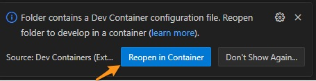

# Getting Started v0.31

<details>
<summary>Getting Started on Windows (click to expand)</summary>

## Docker
  * The official documentation for installing Docker Desktop v4.20 (or newer) on Window with [WSL 2 backend](https://docs.docker.com/desktop/install/windows-install/)
  * OR Use [chocolatey](https://chocolatey.org/install) to install [Docker Desktop](https://community.chocolatey.org/packages/docker-desktop)
  * OR Older ScreenStep [documentation](docs/Docker_Windows/docker_installation_on_windows_10_pro_using_wsl_2_backend.md) with step-by-step instructions and screenshots
  * Make sure your Windows Subsystem for Linux (wsl) is v2 (or higher)
  ```
  wsl --update
  ```

## Visual Studio Code (vscode)
  * The official documentation for installing Visual Studio Code on [Windows](https://code.visualstudio.com/docs/?dv=win32user)
  * OR Use [chocolatey](https://chocolatey.org/install) to install [vscode](https://community.chocolatey.org/packages/vscode)
  ```
  choco install vscode
  ```

## Git
  * The official documentation for installing Git on [Windows](https://git-scm.com/download/win)
  * OR Use [chocolatey](https://chocolatey.org/install) to install [git](https://community.chocolatey.org/packages/git)
  ```
  choco install git.install --params "'/GitAndUnixToolsOnPath /WindowsTerminal /NoAutoCrlf'"
  ```
  * NOTE: 2024-Dec-04 This may not matter anymore, finish the install/configuration and see if things work as expected
  * NOTE: If git is already installed you need to put "C:\Program Files\Git\bin" first on your PATH. Here is a [script](docs/scripts/Git-Bash.ps1) to help you.

## GNU Make
  * Can download the [Setup](https://gnuwin32.sourceforge.net/downlinks/make.php) from [SourceForge](https://gnuwin32.sourceforge.net/packages/make.htm)
  * OR Use [chocolatey](https://chocolatey.org/install) to install [GNU Make](https://community.chocolatey.org/packages/make)
  ```
  choco install make
  ```

## WinSCP
  * The official documentation for installing WinSCP on [Windows](https://winscp.net/eng/docs/guide_install)
  * OR Use [chocolatey](https://chocolatey.org/install) to install [winscp](https://community.chocolatey.org/packages/winscp)
  * [Register](https://winscp.net/eng/docs/integration_url#registering) WinSCP to handle sftp:// URL addresses
  ```
  choco install winscp
  ```

Go to [Clone the project source code](#clone)
</details>

<details>
<summary>Getting started on macOS (click to expand)</summary>

## Docker
  * The official documentation for installing Docker Desktop on Mac with
    [Apple silicon](https://docs.docker.com/desktop/install/mac-install/)
  * Use macOS [brew](https://brew.sh) cask to install [docker](https://formulae.brew.sh/cask/docker)

## Visual Studio Code (vscode)
  * The official documentation for installing Visual Studio Code on Mac with
    [Apple silicon](https://code.visualstudio.com/docs/setup/mac)
  * Use macOS [brew](https://brew.sh) cask to install [vscode](https://formulae.brew.sh/cask/visual-studio-code)

## Git
  * The official documentation for installing Git on [macOS](https://git-scm.com/book/en/v2/Getting-Started-Installing-Git)
  * Use macOS [brew](https://brew.sh) to install [git](https://formulae.brew.sh/formula/git#default)

Go to [Clone the judging portal source code](#clone)

</details>

&nbsp;

## <a name="clone"></a> Clone the project source code
  * Run Visual Studio Code (vscode)
  * Open the integrated terminal with `Ctrl+~` (control+tilde)
  * Clone the [imathas-docker](https://github.com/COMAP-Math/imathas-docker) project from [GitHub](https://github.com/)
  ```
  > git clone https://github.com/COMAP-Math/imathas-docker
  Cloning into 'imathas-docker'...
  ```
  * Authenticate to GitHub with your web browser

  

## Check out the master branch
  * Change directory into the imathas-docker project
  ```
  > cd imathas-docker
  ```
  * Checkout the [master](https://github.com/COMAP-Math/imathas-docker/tree/master) branch
  ```
  > git checkout master
  ```

## Clone the fork specific to COMAP of the IMathAS source code
  * Change directory into the imathas-docker project
  ```
  > cd imathas-docker
  ```
  * Clone the fork of the [IMathAS](https://github.com/COMAP-Math/IMathAS) project from [GitHub](https://github.com/)
  ```
  > git clone https://github.com/COMAP-Math/IMathAS
  Cloning into 'IMathAS'...
  ```

## Customize the development environment
  * Download the latest [.env](docs/examples/env.example) example and rename it to .env and save it to the project directory
  ```
  /path/to/imathas-docker/.env
  ```
  Eventually there will be a configuration program to setup this file but for now manually edit the file and customize the following varables.
  ```
  # Git (GitHub email address)
  GIT_USER_EMAIL=user@comap.org
  GIT_USER_NAME="First Last"

  # Apache
  APACHE_SERVER_ADMIN=user@comap.org
  ```

  Keep this file secure. It contains keys and unencrypted password.

## Start Docker Desktop
  * Confirm Docker Desktop is running

## Open project folder in Visual Studio Code
  * Make sure Docker Desktop is running
  * File > Open Folder ... (Ctrl+K Ctrl+O)
  * Navigate to the imathas-docker folder and `Select Folder`
  * Click `Yes, I trust the authors` button

  

## Miscellaneous
  * You may receive several dialogs from vscode about installing extensions. Install the recommended extensions.

  

  * Allow vscode to re-open the project in a container

  

  * The first run will take time. You can click `show log` to see what vscode is doing.

  

You should see something similar to this message on a successful deployment.
```
Running the postCreateCommand from devcontainer.json...

[63770 ms] Start: Run in container: /bin/sh -c ./.devcontainer/postCreateCommand.sh
==> Working directory: /workspace
==> Load environment variables from .env file
=> Customize git user configuration
=> Setting git 'user.name' user@comap.org and 'user.email' First Last
==> Setting timezone to: America/New_York

Current default time zone: 'America/New_York'
Local time is now:      Mon Dec  2 17:41:56 EST 2024.
Universal Time is now:  Mon Dec  2 22:41:56 UTC 2024.
```
## IMathAS
* Run IMathAS application
```
cd imathas-docker
make run-devel
```
* Open your favorite browser, navigate to
```
http://localhost
```
First run, you will need to configure the database connection and apply
any customizations.
