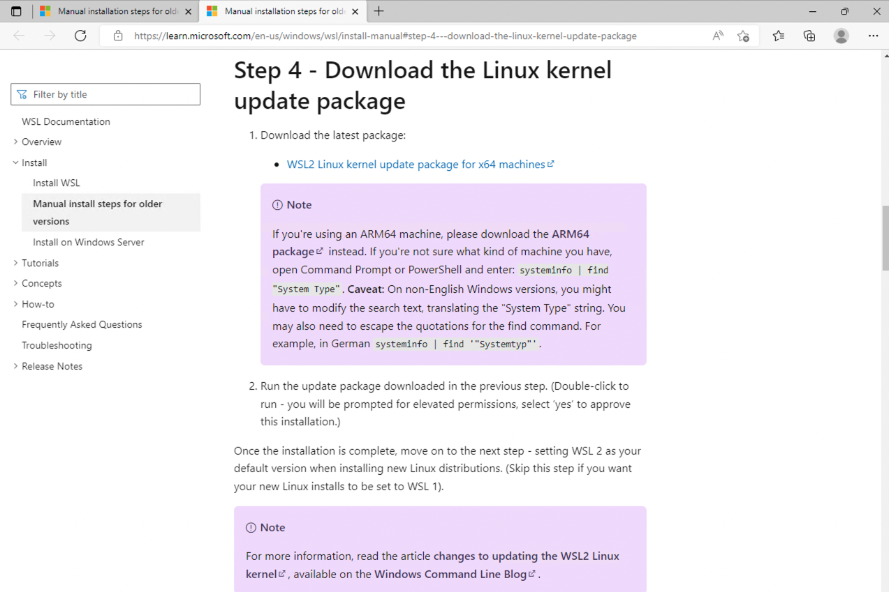
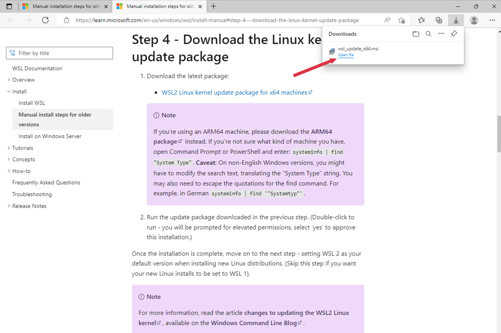

# Docker Installation on Windows 10 Pro using WSL 2 Backend
Docker Installation HOWTO for Windows 10 Pro using WSL 2 Backend

# Table of contents
1. Download Docker Installation File
2. Launch Docker Installation File
3. Docker Desktop Installer- UAC
4. Docker Desktop Installer - Initializing
5. Docker Desktop Installation - Configuration
6. Docker Desktop Installer - Unpacking files
7. Docker Desktop Installation - Installation Succeeded
8. Login and Launch Docker Desktop
9. Docker Desktop - Service Agreement
10. Docker Desktop - WSL 2 Installation
11. Docker Desktop - WSL2 Linux Kernel Update Package
12. Docker Desktop - Open WSL2 Linux Kernel Update Package
13. Docker Desktop - WSL2 Linux Kernel Installer
14. Windows Subsystem for Linux Update Setup Wizard
15. Windows Subsystem for Linux Update Setup - Installing
16. Windows Subsystem for Linux Update - UAC
17. Windows Subsystem for Linux Update Setup - Installing
18. Windows Subsystem for Linux Update Setup Wizard - Finish
19. Login and Launch Docker Desktop
20. Docker Desktop Tutorial - Getting Started
21. Docker Desktop Tutorial - Intro
22. Docker Desktop Tutorial - Step 1, Clone
23. Docker Desktop Tutorial - First Step Finished
24. Docker Desktop Tutorial - Step 2, Build
25. Docker Desktop Tutorial - Step 2 Continued
26. Docker Desktop Tutorial - Step 3, Run
27. Docker Desktop Tutorial - Step 4, Share
28. Docker Desktop - Tutorial
29. Docker Desktop - Getting Started Tutorial
30. Docker Desktop - Interface

## 1. Download Docker Installation File

Visit [https://docs.docker.com/desktop/install/windows-install/](https://docs.docker.com/desktop/install/windows-install/) and download **Docker Desktop for Windows**

## 2. Launch Docker Installation File

Once the download is completed, click on the .exe file and select Open

## 3. Docker Desktop Installer- UAC

If prompted to allow Docker by User Account Control (UAC) to install on your computer, click Yes

## 4. Docker Desktop Installer - Initializing

The installation package will now be automatically verified - this could take a few minutes

## 5. Docker Desktop Installation - Configuration

Make sure the following options are selected or have a check mark in front of them:

- Ue WSL 2 instead of Hyper-V (recommended)
- Add shortcut to desktop

Click on the Ok button

## 6. Docker Desktop Installer - Unpacking files

The install process will now start to unpack the needed installation files, this is an automated process and can take multiple minutes to complete

## 7. Docker Desktop Installation - Installation Succeeded

When the installation is finished, you must restart or reboot the computer, so click on the **Close and restart **button

## 8. Login and Launch Docker Desktop

After the reboot, log in to your computer and look for the Docker Desktop icon

Doube click the icon to launch Docker Desktop

## 9. Docker Desktop - Service Agreement

The first time launching Docker Desktop, you will be shown the Service Agreement - click the **Accept** button to continue

## 10. Docker Desktop - WSL 2 Installation

As part of the installation, you also need to install WSL 2 Linux Kernel by clicking the link in the popup window

[https://aka.ms/wsl2kernel](https://aka.ms/wsl2kernel)

## 11. Docker Desktop - WSL2 Linux Kernel Update Package

In your web browser, a page should load with a link to download the latest package, **WSL2 Linux kernel update package for x64 machines**

## 12. Docker Desktop - Open WSL2 Linux Kernel Update Package

Once the download is finished, click on Open file to install the package

## 13. Docker Desktop - WSL2 Linux Kernel Installer

A small popup window should appear and start the installation process

## 14. Windows Subsystem for Linux Update Setup Wizard

In the *Welcome to the Windows Subsystem for Linux Update Setup Wizard* window, click **Next**

## 15. Windows Subsystem for Linux Update Setup - Installing

The installation process is automated, but can take multiple minutes

## 16. Windows Subsystem for Linux Update - UAC

If presented with the *Windows Subsystem for Linux Update Setup User Account Control (UAC*) window, click **Yes**

## 17. Windows Subsystem for Linux Update Setup - Installing

The installation process is automated, but can take multiple minutes - continue to wait for the process to finish

## 18. Windows Subsystem for Linux Update Setup Wizard - Finish

When the install is complete, click the **Finish** button and reboot the PC

## 19. Login and Launch Docker Desktop

After the reboot, log in to your computer and look for the Docker Desktop icon

Doube click the icon to launch Docker Desktop

## 20. Docker Desktop Tutorial - Getting Started

Click the **Start** button to begin with the tutorial

## 21. Docker Desktop Tutorial - Intro

The tutorial has all the commands queued up for you, so all you have to do is click the text box to copy the command to the Windows Powershell window

## 22. Docker Desktop Tutorial - Step 1, Clone

Click the command box to copy the command to the PowerShell window (aka terminal)

## 23. Docker Desktop Tutorial - First Step Finished

The first command can take a moment or two to finish, check the right side of the interface window to see it's progress and status

## 24. Docker Desktop Tutorial - Step 2, Build

Click the text box to start the next step of building the Docker image

## 25. Docker Desktop Tutorial - Step 2 Continued

The automated build process will continue to run and can take several minutes to finish

## 26. Docker Desktop Tutorial - Step 3, Run

Once the build process is finished, click the text box to run you first container

## 27. Docker Desktop Tutorial - Step 4, Share

You are now presented the option to share your newly created image - since it is just the tutorial it is not necessary, so click the **Done** button

## 28. Docker Desktop - Tutorial

Click the Browser launch icon to get further tutorial with Docker Desktop

## 29. Docker Desktop - Getting Started Tutorial

You will now see and have the optioni to follow the available Docker Desktop Tutorial

## 30. Docker Desktop - Interface

Back at the Docker Desktop interface, you can see what has been created, installed, and currently running
